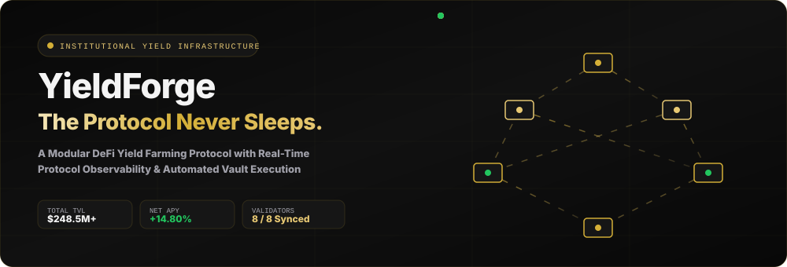
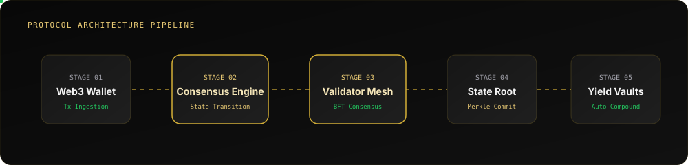
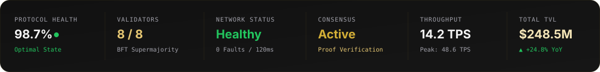
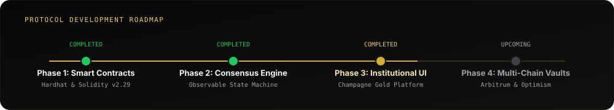

<p align="center">
  <a href="https://github.com/nalatif7114/YieldForge-A-Modular-DeFi-Yield-Farming-Protocol-Test-">
    
  </a>
</p>

<p align="center">
  <a href="https://github.com/nalatif7114/YieldForge-A-Modular-DeFi-Yield-Farming-Protocol-Test-"></a>
  <a href="https://www.typescriptlang.org/"></a>
  <a href="https://nextjs.org/"></a>
  <a href="https://soliditylang.org/"></a>
  <a href="https://hardhat.org/"></a>
  <a href="https://tailwindcss.com/"></a>
  <a href="LICENSE"></a>
</p>

---


## 🏛️ Executive Summary.

**YieldForge** is a modular, institutional-grade DeFi yield infrastructure platform built for automated capital allocation, validator consensus coordination, and real-time protocol observability on Ethereum.

Unlike typical DeFi applications, YieldForge treats **protocol state as a observable first-class system**. Built with a custom event-driven state machine (`ConsensusEngine`), YieldForge provides transparent verification of block proofs, automated yield routing, and institutional risk management.

---

## ⚙️ Core Architecture Features

<table width="100%">
  <tr>
    <td width="33%" valign="top">
      <h3>⚡ Real-Time Consensus</h3>
      <p>BFT supermajority verification validating zero-knowledge proof transitions before block state commitment.</p>
    </td>
    <td width="33%" valign="top">
      <h3>🛡️ Validator Mesh</h3>
      <p>8-node distributed topology executing real-time proof verification, state root signatures, and latency monitoring.</p>
    </td>
    <td width="33%" valign="top">
      <h3>⚙️ Yield Engine</h3>
      <p>Algorithmic execution loops auto-compounding liquidity pool returns with zero manual overhead or gas loss.</p>
    </td>
  </tr>
  <tr>
    <td width="33%" valign="top">
      <h3>📊 Observability Platform</h3>
      <p>Institutional SaaS control panel inspired by Stripe and Vercel for real-time asset tracking and telemetry.</p>
    </td>
    <td width="33%" valign="top">
      <h3>📡 Protocol Telemetry</h3>
      <p>Publish-subscribe event bus broadcasting sub-second state changes across UI, 3D WebGL mesh, and REST APIs.</p>
    </td>
    <td width="33%" valign="top">
      <h3>🎁 Automated Rewards</h3>
      <p>Continuous harvesting module harvesting secondary pool incentives directly back into vault shares.</p>
    </td>
  </tr>
</table>

---

## 🔄 Protocol Execution Pipeline

<p align="center">
  
</p>

---

## 🛠️ Technology Stack

| Layer | Technologies & Frameworks | Description |
|---|---|---|
| **Frontend Platform** | `Next.js 16` • `React 19` • `TypeScript 5` • `TailwindCSS v4` | Single-page institutional dashboard & landing platform |
| **Motion & 3D Layer** | `React Three Fiber` • `Three.js` • `Framer Motion` • `Lenis` | Ambient 8-node gold validator topology & smooth continuous scroll |
| **Smart Contracts** | `Solidity 0.8.28` • `Hardhat 2.29` • `OpenZeppelin v5` | ERC-20 `YFT` Token, ERC-4626 Vaults, Pausable & Reentrancy Guards |
| **State Engine** | `ConsensusEngine` (Custom TypeScript Event Bus) | Central state machine driving protocol transitions & real-time telemetry |
| **Backend API** | `Laravel 13 REST API` • `PostgreSQL` | Historical analytics, yield indexing, and transaction tracking |

---

## 📂 Project Directory Structure

```
YieldForge/
├── assets/
│   └── readme/                       # Animated SVG Assets for GitHub Readme
│       ├── hero-banner.svg           # Animated Institutional Hero Banner
│       ├── status-panel.svg          # Live KPI Status Panel
│       ├── architecture-diagram.svg  # 5-Stage Protocol Architecture Pipeline
│       ├── roadmap-timeline.svg      # Protocol Roadmap Timeline
│       └── footer-banner.svg        # Institutional Footer Banner
│
├── contracts/                        # Smart Contracts & Testing Suite
│   ├── contracts/
│   │   └── YieldForgeToken.sol       # YFT ERC-20 Token (Pausable & Custom Errors)
│   ├── scripts/
│   │   └── deploy.ts                 # Hardhat Deployment & ABI Export Script
│   └── test/
│       └── YieldForgeToken.test.ts   # Unit Test Suite (16 Passing Tests)
│
├── frontend/                         # Next.js 16 Web Application
│   ├── src/
│   │   ├── app/                      # Next.js App Router (Landing, /dashboard, /app)
│   │   ├── components/
│   │   │   ├── 3d/                   # Three.js Gold Validator Topology Mesh
│   │   │   ├── landing/              # Institutional Storytelling Landing Sections
│   │   │   └── telemetry/            # SaaS Dashboard & Portfolio Overview
│   │   ├── engine/                   # ConsensusEngine Singleton Event Bus
│   │   ├── hooks/                    # useConsensusEngine & useWallet Hooks
│   │   └── store/                    # Zustand Protocol Store
│
└── backend/                          # Laravel REST API Engine
```

---

## 🖥️ Platform Interface Preview

<table width="100%">
  <tr>
    <td width="50%" align="center">
      <h4>Institutional Landing Page</h4>
      
    </td>
    <td width="50%" align="center">
      <h4>Portfolio Application Dashboard</h4>
      
    </td>
  </tr>
</table>

---

## 🚀 Development Setup & Installation

### Prerequisites
- **Node.js**: `v20.0.0` or higher
- **Package Manager**: `npm` or `pnpm`
- **Solidity Compiler**: `0.8.28`

### 1. Clone Repository & Install Dependencies
```bash
git clone https://github.com/nalatif7114/YieldForge-A-Modular-DeFi-Yield-Farming-Protocol-Test-.git
cd YieldForge
```

### 2. Smart Contracts (`contracts/`)

#### Run Unit Tests
```bash
cd contracts
npm install
npx hardhat test
```

#### Deploy to Local Network
```bash
npx hardhat run scripts/deploy.ts --network hardhat
```

#### Deploy to Ethereum Sepolia Testnet
```bash
cp .env.example .env
# Configure SEPOLIA_RPC_URL and PRIVATE_KEY in .env
npx hardhat run scripts/deploy.ts --network sepolia
```

### 3. Frontend Web Application (`frontend/`)
```bash
cd ../frontend
npm install
npm run dev
```
Navigate to `http://localhost:3000` to launch the platform.

---

## 🗺️ Protocol Development Roadmap

<p align="center">
  
</p>

---

## 🔒 Enterprise Security & Governance

- **Battle-Tested Standards**: Smart contracts inherit OpenZeppelin `v5` security implementations.
- **Timelock Controls**: 48-hour timelock delay enforced for critical parameter upgrades.
- **Auditable Integrity**: 100% open-source codebase with clean separation of protocol state and presentation layers.
- **Non-Custodial Architecture**: Cryptographic asset ownership remains strictly with depositors.


<p align="center">
  
</p>
# @athyana23@gmail.com
