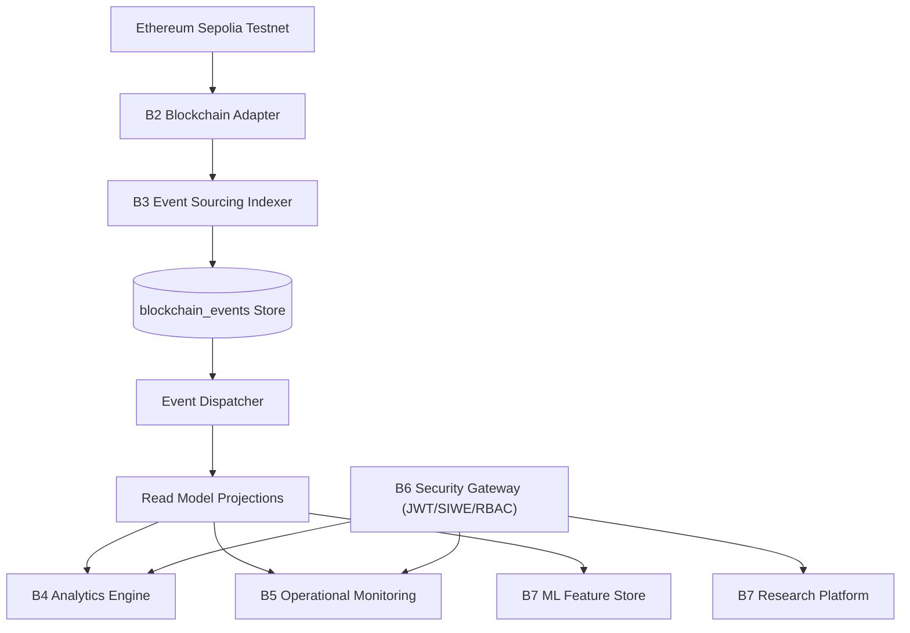

# YieldForge Protocol — Enterprise DeFi Yield Farming & Data Intelligence Platform

[](docs/testing.md)
[](docs/testing.md)
[](docs/blockchain.md)
[](docs/architecture.md)

YieldForge is an enterprise-grade, event-driven DeFi Yield Farming & Staking Protocol backend and research platform built on Ethereum Sepolia testnet. The system combines an immutable event store, CQRS projection engine, real-time protocol analytics, institutional operational monitoring, enterprise API security gateway, and an ML research feature store.

---

##  Architecture Overview



---

## 🛠️ Technology Stack

- **Smart Contracts**: Solidity ^0.8.20, Ethers.js, Hardhat (Ethereum Sepolia Testnet)
- **Backend Core**: PHP 8.2+, Laravel 11 framework, SQLite/PostgreSQL, Redis
- **Security & Gateway**: JWT (HS256), SIWE (EIP-4361 / EIP-191), HMAC-SHA256 Signatures, Argon2id
- **Testing**: PHPUnit (104 Unit & Feature Tests, 553 Assertions)
- **Frontend**: Next.js 14, React, TailwindCSS, Viem / Wagmi

---

##  Project Directory Structure.
=======
##  Core Features & Modules
>>>>>>> 79e0914d (docs: add enterprise architecture and technical documentation suite)

- **Phase B1 (Foundation)**: Deployed ERC20 YieldForge Token (`YF`) and YieldForgeStaking contracts on Sepolia testnet.
- **Phase B2 (Blockchain Adapter)**: JSON-RPC `eth_getLogs` client, Keccak-256 topic signature codec, log decoding DTOs.
- **Phase B3 (Event Sourcing & Indexer Engine)**: Atomic `blockchain_events` event store, 5 read model projections (`WalletProjection`, `PoolProjection`, `RewardProjection`, `ProtocolProjection`, `BlockProjection`), checkpointing, replay engine (`php artisan indexer:replay`).
- **Phase B4 (Protocol Analytics Engine)**: Real-time TVL, dynamic APY, user position analytics, chart time-series datasets.
- **Phase B5 (Institutional Monitoring Platform)**: System Health Score (0-100), alert rules engine, queue/cache monitoring, RPC metrics, operational export streams.
- **Phase B6 (Enterprise Security & API Gateway)**: JWT authentication, SIWE wallet login, RBAC permission enforcement, API Keys with IP allowlists, HMAC request signing, rate limiting, audit logging.
- **Phase B7 (Data Intelligence & Research Platform)**: 6 ML datasets (`wallet_behavior`, `pool_activity`, `reward_distribution`, `protocol_growth`, `staking_history`, `transaction_features`), 10 ML research features calculation, 5-point data quality validation, benchmark engine, JSON/CSV exports.

---

## 🚀 Quick Start Guide

### 1. Installation & Environment Setup
```bash
# Clone the repository and enter backend directory
cd backend

# Install dependencies
composer install

# Environment setup
cp .env.example .env
php artisan key:generate

# Database setup
php artisan migrate --force
php artisan db:seed --class=SecuritySeeder
```

### 2. Running Backend Server & Indexer
```bash
# Start local server
php artisan serve --port=8000

# Run real-time blockchain indexer sync from Sepolia
php artisan blockchain:sync

# Run event sourcing projection replay
php artisan indexer:replay

# Run security audit & dataset build
php artisan security:audit
php artisan research:build
```

### 3. Running Test Suite
```bash
php artisan test
```
Result: **104 passed, 553 assertions**.

---

## 📚 Complete Technical Documentation Suite (`docs/`)

- [**Architecture Documentation**](docs/architecture.md): CQRS, Event Sourcing, Projection Engine & Layer Breakdown.
- [**Blockchain Adapter Guide**](docs/blockchain.md): Smart contracts, JSON-RPC, Keccak-256 topic codec, event decoding.
- [**Event Sourcing Specification**](docs/event-sourcing.md): Event store, projection handlers, checkpoints, replay engine.
- [**Protocol Analytics Guide**](docs/analytics.md): TVL, APY calculation, time-series aggregations, analytics API.
- [**Monitoring & Operations Guide**](docs/monitoring.md): System Health Score (0-100), alert engine, queue/cache metrics.
- [**Enterprise Security & Gateway Guide**](docs/security.md): JWT, SIWE (EIP-4361), RBAC, API Keys, request signatures, rate limiting.
- [**Data Intelligence & Research Platform**](docs/research.md): ML feature engineering, feature store, data quality engine, dataset exports.
- [**REST API Reference Specification**](docs/api.md): Complete guide to all 61 REST API endpoints.
- [**Database Schema & ERD**](docs/database.md): Complete entity relationship diagrams and table specifications.
- [**Deployment & Configuration Guide**](docs/deployment.md): Environment setup, Sepolia deployment, queues, scheduler.
- [**Testing Strategy & Results**](docs/testing.md): Automated unit/feature test suite coverage (104 tests / 553 assertions).
- [**System Diagrams Collection**](docs/diagrams.md): All Mermaid sequence, component, flowchart, and ERD diagrams.
- [**Protocol Development Roadmap**](docs/roadmap.md): Completed phases (B1-B7) and future ML/AI roadmap (B8-B10).
