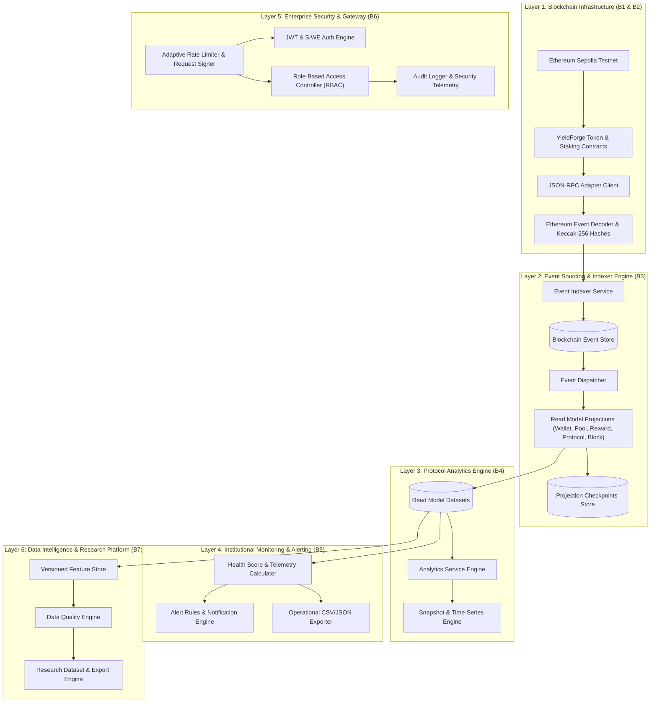
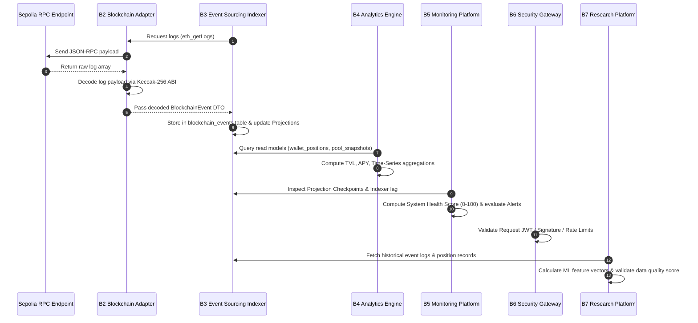

# YieldForge Architecture Documentation

## Overview & System Philosophy

YieldForge is an enterprise-grade, event-driven DeFi Yield Farming & Staking Protocol backend built on top of Ethereum Sepolia testnet. The system enforces strict architectural decoupling across discrete pipeline layers (Phases B1 to B7), guaranteeing that blockchain read operations, indexing, projection read-model building, analytics calculations, operational monitoring, and data intelligence remain decoupled and non-interfering.

---

## 🏛️ Layered Architectural Breakdown

### 1. Blockchain Layer (Phases B1 & B2)
- **YieldForgeToken** (`ERC20`): Minting, transfer logic, allowances.
- **YieldForgeStaking**: Pool management, stake/withdraw functions, reward calculation.
- **RpcClient & EthereumCodec**: Connects to Sepolia RPC endpoints via JSON-RPC `eth_getLogs` and `eth_blockNumber`, encoding event topics using Keccak-256 hashes (`Staked`, `Withdrawn`, `RewardPaid`, `PoolAdded`).

### 2. Event Sourcing Engine (Phase B3)
- Stores un-mutated log entries in `blockchain_events`.
- Employs CQRS (Command Query Responsibility Segregation) pattern: Write side consumes raw log events; Read side updates isolated projection tables (`wallet_positions`, `pool_snapshots`, `reward_snapshots`, `protocol_statistics`, `block_checkpoints`).
- Atomic database transactions persist event logs and advance `projection_checkpoints` deterministically.

### 3. Protocol Analytics Engine (Phase B4)
- Aggregates historical metrics into time-series data streams (`hourly_statistics`, `daily_statistics`).
- Computes real-time TVL (Total Value Locked), APY (Annual Percentage Yield), transaction throughput, and chart datasets.

### 4. Institutional Monitoring Platform (Phase B5)
- Evaluates system health score (0-100) combining indexer block lag, RPC latency, memory usage, queue length, and failure rates.
- Manages operational alert rules and CSV/JSON event stream exporters.

### 5. Enterprise Security & API Gateway (Phase B6)
- **Authentication**: JWT access tokens (HS256) and EIP-4361 Sign-In With Ethereum (SIWE) nonces with EIP-191 signature validation.
- **API Gateway**: Adaptive sliding-window rate limiting, HMAC-SHA256 request signature validation (`X-Signature`, `X-Timestamp`, `X-Nonce`), replay attack prevention, and API key management with IP allowlists.

### 6. Data Intelligence & Research Platform (Phase B7)
- Computes 10 ML research features (`wallet_age_days`, `average_stake_formatted`, `staking_frequency`, `holding_duration_days`, `reward_velocity`, `stake_growth_pct`, `unstake_ratio`, `active_days`, `transaction_interval_hours`, `pool_diversity_count`).
- Maintains versioned feature sets in `feature_sets` and runs 5-point data quality validation suites.

---

## 🔄 Component Interaction & Data Flow

