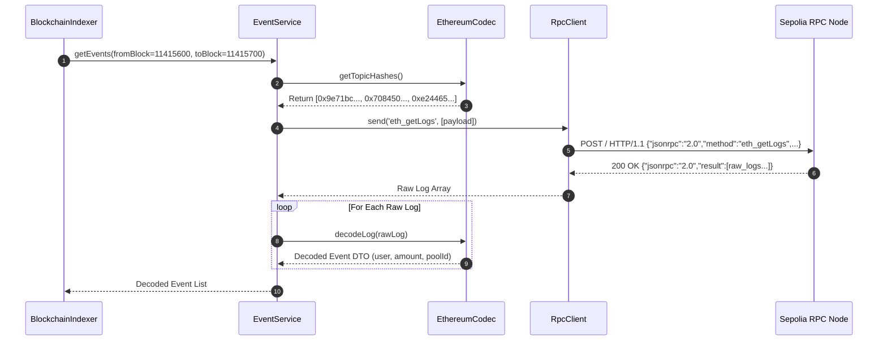

# YieldForge Blockchain Adapter Documentation (Phase B2)

## Overview

The B2 Blockchain Adapter forms the foundational read interface connecting the YieldForge PHP backend to the Ethereum Sepolia testnet. It provides robust JSON-RPC network abstraction, ABI loading, raw Keccak-256 topic signature mapping, event decoding, and block synchronization utilities without mutating smart contract state.

---

## 📜 Deployed Smart Contracts

- **YieldForgeToken (`YF`)**: `0x527336e72F31840aF45aB3BDDfd7d3958BF5758f`
  - Standard ERC20 token providing staking liquidity.
- **YieldForgeStaking**: `0xfeA5aaB6C60C48c080AAeFC7eAD22610004E1A5F`
  - Multi-pool staking contract supporting flexible staking durations and reward distribution.

---

## 🛠️ Key Adapter Services

### 1. `RpcClient` (`App\Services\Blockchain\RpcClient`)
- Executes HTTP POST requests to Sepolia RPC (`BLOCKCHAIN_RPC_URL`).
- Implements methods:
  - `getBlockNumber()`: Invokes `eth_blockNumber`, returning hexadecimal integer.
  - `getLogs(array $filter)`: Invokes `eth_getLogs` with `fromBlock`, `toBlock`, `address`, and `topics` payload.
  - Handles curl network errors, rate limit retries, and invalid response validation.

### 2. `EthereumCodec` (`App\Services\Blockchain\EthereumCodec`)
- Computes canonical Keccak-256 topic zero hashes for target event signatures:
  - `Staked(address,uint256,uint256)` -> `0x9e71bc8eea02a63969f509818f2dafb9254532904319f9dbda79b67bd34a5f3d`
  - `Withdrawn(address,uint256,uint256)` -> `0x708450666126485882779d0476f309d94d86411516e885c345b5c907b8b40810`
  - `RewardPaid(address,uint256)` -> `0xe244656892ca8e2c77d4cb941e7d808e64c39f1c79e67c870104618e7e0a297e`
  - `PoolAdded(uint256,address,uint256)` -> `0x6a053c899852233f2203795b6a715f212267f5b3310705a6113b53f6ef6378e9`
- Decodes raw 32-byte hexadecimal data parameters into uint256 amounts and address strings.

### 3. `EventService` (`App\Services\Blockchain\EventService`)
- Builds the `eth_getLogs` JSON-RPC filter payload.
- Ensures all block parameters (`fromBlock`, `toBlock`) are formatted as hex string values (`0x...`).
- Decodes raw JSON-RPC response logs into DTO objects ready for ingestion.

### 4. `ContractService` & `NetworkService`
- Exposes smart contract configuration metadata, network names, chain IDs (`11155111`), and contract ABI definitions.

---

## 🔄 Sequence Diagram: Blockchain Log Synchronization

