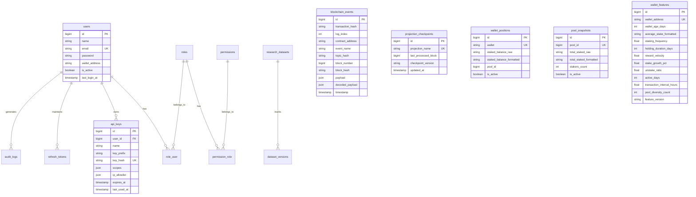

# YieldForge Database Schema & ERD Documentation

## Overview

YieldForge utilizes a relational database architecture designed to support CQRS event sourcing, read-model projections, time-series analytics, RBAC enterprise security, institutional monitoring telemetry, and ML feature storage.

---

## 🧜‍♂️ Entity Relationship Diagram (ERD)

---

## 🗃️ Database Table Definitions

### 1. Event Store & Indexer Engine (Phase B3)
- `blockchain_events`: Primary event store containing all on-chain log entries (`transaction_hash`, `log_index`, `contract_address`, `event_name`, `topic_hash`, `block_number`, `block_hash`, `payload`, `decoded_payload`, `timestamp`).
- `projection_checkpoints`: Tracks sync block height for each projection (`projection_name`, `last_processed_block`, `checkpoint_version`).
- `wallet_positions`: Read model for wallet balances (`wallet`, `staked_balance_raw`, `staked_balance_formatted`, `pool_id`, `is_active`).
- `pool_snapshots`: Read model for pool state (`pool_id`, `total_staked_raw`, `total_staked_formatted`, `stakers_count`, `is_active`).
- `reward_snapshots`: Read model for rewards distributed (`wallet`, `pool_id`, `total_rewards_raw`, `total_rewards_formatted`).
- `protocol_statistics`: Read model for global protocol stats (`total_value_locked_raw`, `total_value_locked_formatted`, `active_stakers_count`).
- `block_checkpoints`: Read model for current indexed block height.

### 2. Protocol Analytics Engine (Phase B4)
- `hourly_statistics`: Time-series aggregation per hour (`timestamp`, `tvl_formatted`, `apy`, `volume_formatted`, `tx_count`, `active_users`).
- `daily_statistics`: Time-series aggregation per day (`timestamp`, `tvl_formatted`, `apy`, `volume_formatted`, `tx_count`, `active_users`).
- `transaction_histories`: Denormalized transaction log for fast query APIs (`transaction_hash`, `wallet`, `event_name`, `amount_raw`, `amount_formatted`, `pool_id`, `block_number`, `timestamp`).

### 3. Institutional Monitoring Platform (Phase B5)
- `monitoring_metrics`: Historical log of system health scores and resource consumption metrics (`health_score`, `indexer_lag`, `rpc_latency_ms`, `queue_size`, `memory_usage_mb`).
- `alerts`: System alert events log (`alert_type`, `severity`, `message`, `acknowledged`, `acknowledged_at`).
- `alert_rules`: Configured threshold rules (`rule_name`, `metric_name`, `condition`, `threshold_value`, `is_enabled`).

### 4. Enterprise Security & API Gateway (Phase B6)
- `users`: Registered administrative and Web3 users (`name`, `email`, `password`, `wallet_address`, `is_active`, `last_login_at`).
- `roles`: Role definitions (`name`, `slug`, `description`).
- `permissions`: Permission scope definitions (`name`, `slug`, `description`).
- `role_user`: Pivot table mapping users to roles.
- `permission_role`: Pivot table mapping roles to permissions.
- `api_keys`: API key definitions (`user_id`, `name`, `key_prefix`, `key_hash`, `scopes`, `ip_allowlist`, `expires_at`, `last_used_at`).
- `refresh_tokens`: Active JWT refresh tokens (`user_id`, `token_hash`, `device_info`, `ip_address`, `expires_at`, `revoked`).
- `wallet_nonces`: SIWE nonces (`wallet_address`, `nonce`, `expires_at`, `used`).
- `audit_logs`: User activity trail (`user_id`, `action`, `resource`, `ip_address`, `user_agent`, `payload`).
- `security_events`: Security threat alerts (`event_type`, `severity`, `ip_address`, `details`).
- `login_attempts`: Authentication attempt log (`identity`, `ip_address`, `successful`).

### 5. Data Intelligence & Research Platform (Phase B7)
- `research_datasets`: Registered research dataset definitions (`name`, `type`, `version`, `row_count`, `quality_score`, `status`).
- `feature_sets`: Versioned feature set definitions (`name`, `version`, `feature_count`, `metadata`).
- `wallet_features`: Wallet ML feature vectors (`wallet_address`, `wallet_age_days`, `average_stake_formatted`, `staking_frequency`, `holding_duration_days`, `reward_velocity`, `stake_growth_pct`, `unstake_ratio`, `active_days`, `transaction_interval_hours`, `pool_diversity_count`, `feature_version`).
- `pool_features`: Staking pool ML features (`pool_id`, `total_staked_formatted`, `active_stakers_count`, `transaction_velocity`, `utilization_rate`, `feature_version`).
- `dataset_versions`: Dataset release versions and checksums (`dataset_id`, `version`, `checksum`, `file_path`, `row_count`).
- `research_exports`: Export history log (`dataset_name`, `format`, `row_count`, `file_name`).
