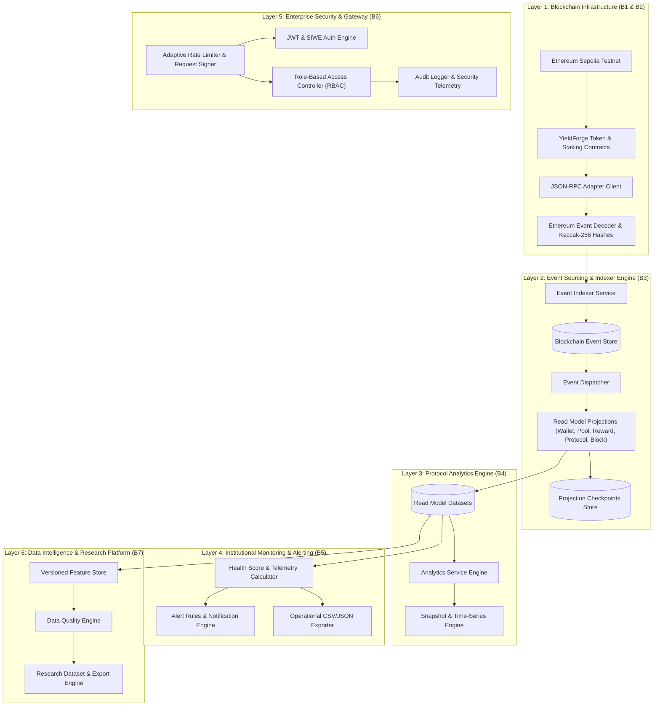
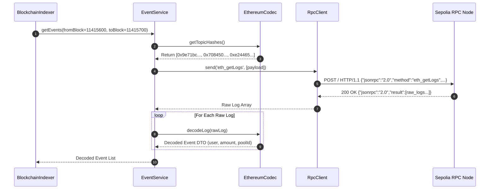
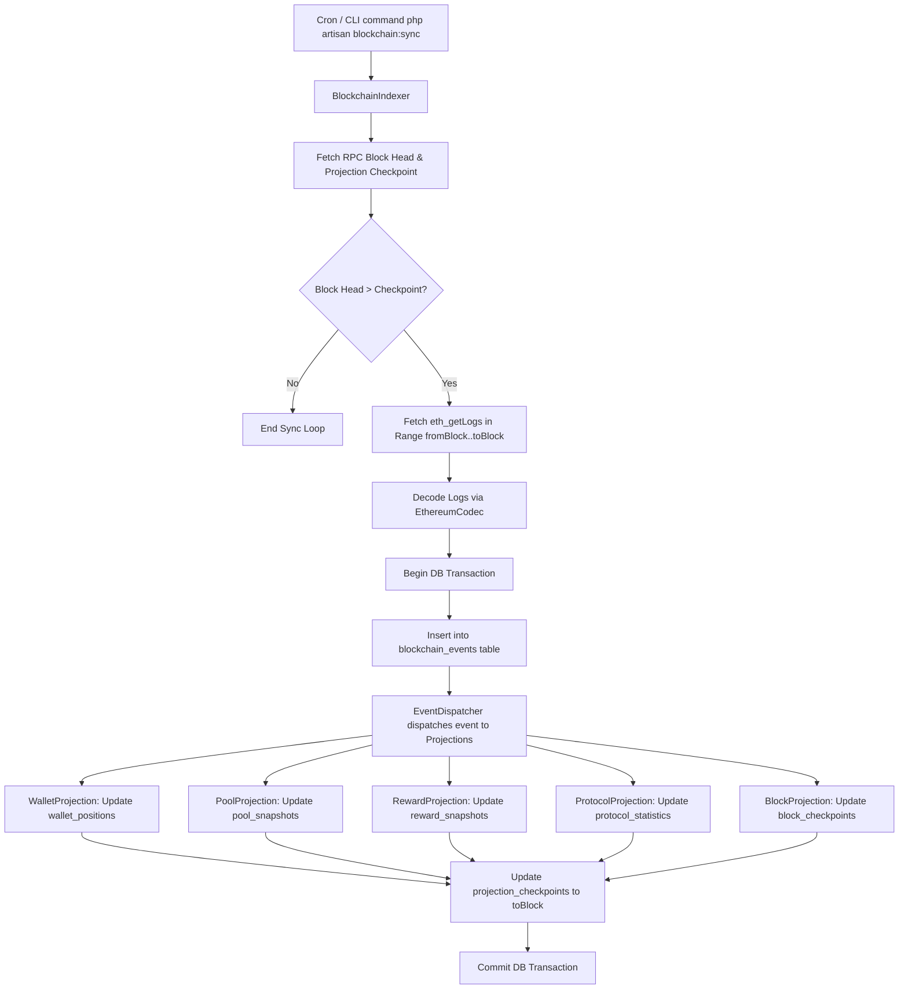
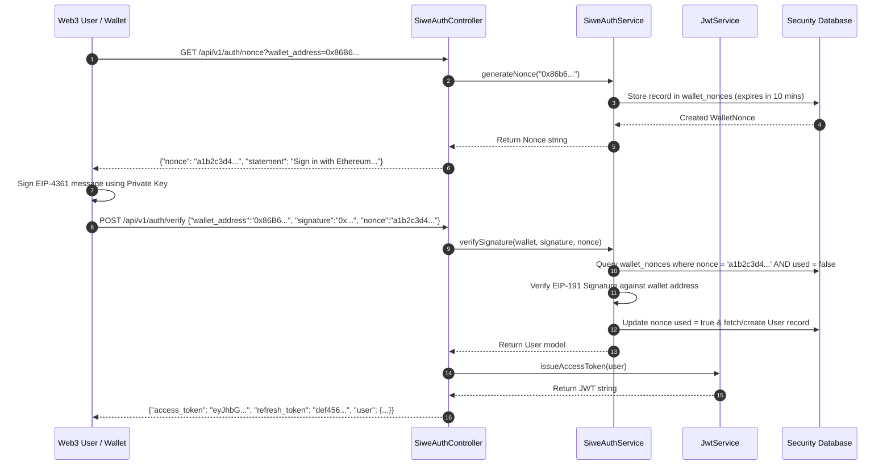
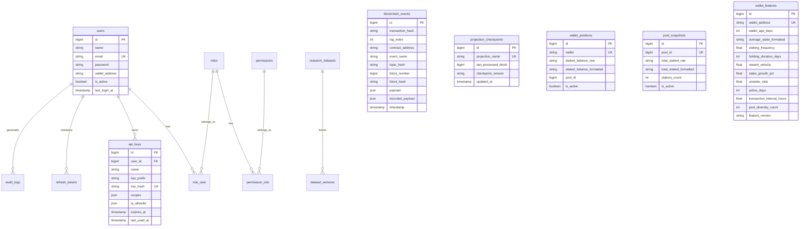

# YieldForge Comprehensive System Diagrams Collection

This document aggregates all system architecture, component, data flow, sequence, ERD, and operational workflow diagrams for the YieldForge protocol.

---

## 1. System Layer Architecture Diagram

---

## 2. Blockchain Ingestion Sequence Diagram

---

## 3. Event Sourcing Ingestion & Projection Flowchart

---

## 4. SIWE Authentication Sequence Diagram

---

## 5. Entity Relationship Diagram (ERD)

