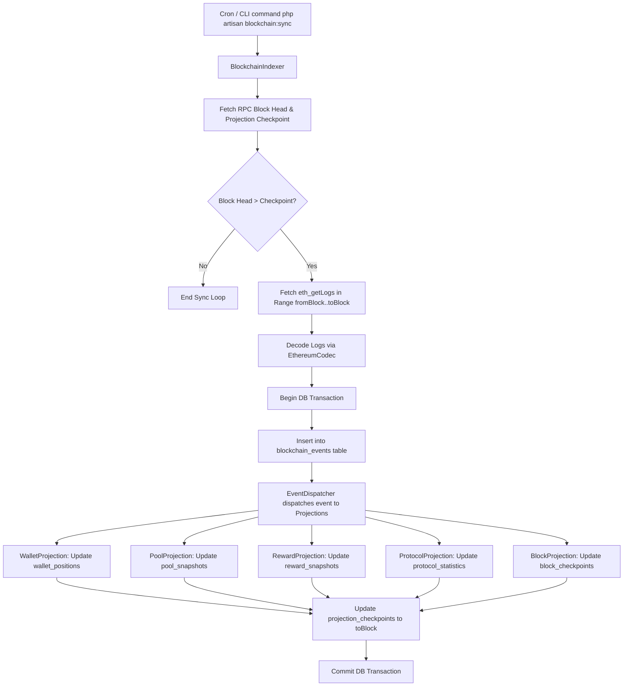

# YieldForge Event Sourcing & Indexer Engine Documentation (Phase B3)

## Overview

Phase B3 implements a Command Query Responsibility Segregation (CQRS) Event Sourcing engine for YieldForge. The indexer reads on-chain events from Ethereum Sepolia via the B2 Blockchain Adapter, appends un-mutated log entries to the `blockchain_events` immutable event store, and dispatches each event to 5 dedicated read-model projection handlers.

---

## 🗄️ Core Components

### 1. `blockchain_events` (Immutable Event Store)
Every decoded on-chain log is persisted with its `transaction_hash`, `log_index`, `contract_address`, `event_name`, `block_number`, `block_hash`, raw `payload`, and `decoded_payload`.

### 2. `EventDispatcher` (`App\Services\Indexer\EventDispatcher`)
Receives decoded event DTOs and routes each event sequentially to registered projection handlers:
- `BlockProjection`
- `WalletProjection`
- `PoolProjection`
- `RewardProjection`
- `ProtocolProjection`

### 3. Read Model Projections
- **BlockProjection**: Tracks current indexed block number in `block_checkpoints`.
- **WalletProjection**: Maintains `wallet_positions` (staked balance, total rewards, active status per wallet).
- **PoolProjection**: Maintains `pool_snapshots` (pool total staked balance, stakers count, active status).
- **RewardProjection**: Maintains `reward_snapshots` (rewards distributed per wallet and pool).
- **ProtocolProjection**: Maintains global `protocol_statistics` (Total Value Locked, active stakers, event counts).

### 4. `ProjectionCheckpoint` & Replay Engine
- `projection_checkpoints` stores the exact `last_processed_block` and `checkpoint_version` for each projection.
- **Atomic Transactions**: Block range sync is wrapped in `DB::transaction()` guaranteeing that events, projections, and checkpoints advance atomically.
- **Replay Engine**: Invoking `php artisan indexer:replay` truncates read model tables, resets checkpoints to block #0, and re-executes all projection handlers over stored `blockchain_events` deterministically.

---

## 🔄 Flow Diagram: Event Ingestion & Projection Pipeline

