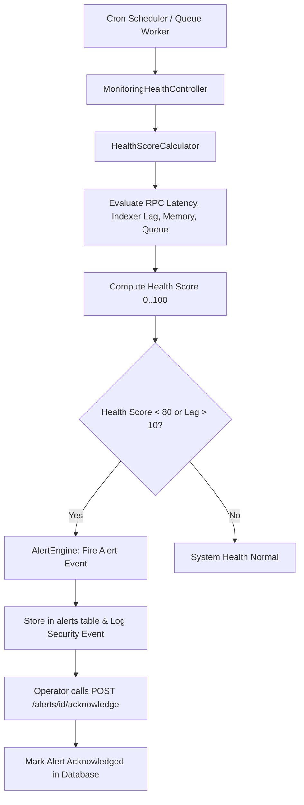

# YieldForge Institutional Monitoring & Operations Platform (Phase B5)

## Overview

Phase B5 introduces enterprise-grade observability, system health scoring, operational alerting, queue/cache monitoring, RPC metric tracking, and audit log exports on top of B3 Event Indexer and B4 Analytics read models.

---

## 🛠️ Operational Monitoring Services

### 1. `HealthScoreCalculator` (`App\Services\Monitoring\Support\HealthScoreCalculator`)
Computes an aggregate System Health Score (0 to 100):
- **Indexer Lag Penalty**: Deducts points if indexer block height falls > 5 blocks behind RPC head.
- **RPC Latency Penalty**: Deducts points if Sepolia RPC response exceeds 500ms.
- **Queue Backlog Penalty**: Deducts points if background queue jobs exceed threshold.
- **Cache Health Penalty**: Verifies Redis / DB cache response responsiveness.

### 2. `AlertEngine` (`App\Services\Monitoring\AlertEngine`)
- Evaluates real-time alert rules:
  - `HighBlockLag`: Triggered when indexer lag > 10 blocks.
  - `RpcLatencyDegraded`: Triggered when RPC latency > 1000ms.
  - `FailedJobsDetected`: Triggered when queue failed jobs count > 0.
- Allows operators to acknowledge alerts via `POST /api/v1/monitoring/alerts/{id}/acknowledge`.

### 3. Monitoring API Endpoints

| Method | Endpoint | Description |
| :--- | :--- | :--- |
| `GET` | `/api/v1/monitoring/dashboard` | Main operational dashboard metrics & health score |
| `GET` | `/api/v1/monitoring/health` | Comprehensive telemetry health evaluation |
| `GET` | `/api/v1/monitoring/queues` | Queue job status, pending, processing, and failed jobs |
| `GET` | `/api/v1/monitoring/cache` | Cache hit/miss rates, memory usage, and driver status |
| `GET` | `/api/v1/monitoring/indexer/history` | Historical indexer block sync execution records |
| `GET` | `/api/v1/monitoring/rpc` | RPC request counts, latency statistics, and error rates |
| `GET` | `/api/v1/monitoring/alerts` | List of active and historical operational alerts |
| `POST` | `/api/v1/monitoring/alerts/{id}/acknowledge` | Mark an alert as acknowledged by operator |
| `GET` | `/api/v1/monitoring/alerts/rules` | Configured threshold rules for system alerts |
| `GET` | `/api/v1/monitoring/history` | Historical monitoring metrics log |
| `GET` | `/api/v1/monitoring/export/events` | Download event log export (CSV / JSON stream) |
| `GET` | `/api/v1/monitoring/export/metrics` | Download system metrics export (CSV / JSON stream) |
| `GET` | `/api/v1/monitoring/performance` | Memory consumption, CPU, and execution response metrics |

---

## 🔄 Monitoring & Alert Workflow

