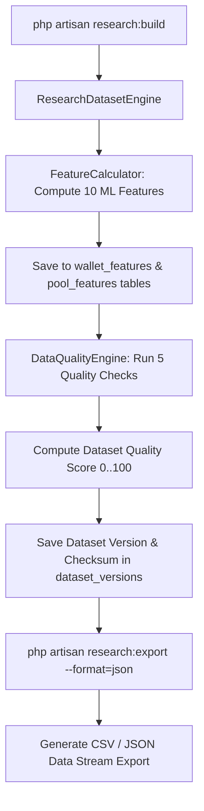

# YieldForge Data Intelligence & Research Platform Documentation (Phase B7)

## Overview

Phase B7 establishes a data intelligence and research platform designed to collect, enrich, calculate ML features, validate data quality, and export research datasets for machine learning models and protocol data science.

---

## 🧪 Core Research Platform Components

### 1. Curated Research Datasets (`ResearchDatasetEngine`)
Generates 6 ML dataset categories:
- `wallet_behavior`: Feature vectors of wallet staking patterns and history.
- `pool_activity`: Liquidity and transaction velocity metrics per pool.
- `reward_distribution`: Reward earning rates across wallets and pools.
- `protocol_growth`: Historical TVL, transaction volume, and user adoption rates.
- `staking_history`: Complete chronological log of stake and withdraw events.
- `transaction_features`: On-chain transaction throughput and block time features.

### 2. ML Feature Engineering (`FeatureCalculator`)
Automatically computes 10 ML research feature variables:
1. `wallet_age_days`: Time elapsed since wallet's first protocol transaction.
2. `average_stake_formatted`: Average staked token balance.
3. `staking_frequency`: Stake transactions count per active month.
4. `holding_duration_days`: Duration between first stake and latest activity.
5. `reward_velocity`: Rewards earned per active day.
6. `stake_growth_pct`: Percentage growth of staked capital.
7. `unstake_ratio`: Ratio of withdrawn capital vs total staked capital.
8. `active_days`: Count of unique days with protocol transactions.
9. `transaction_interval_hours`: Average hours between consecutive transactions.
10. `pool_diversity_count`: Unique staking pools interacted with.

### 3. Versioned Feature Store (`FeatureStoreService`)
Registers feature schemas in `feature_sets`, `wallet_features`, and `pool_features` to support reproducible ML research experiments.

### 4. Data Quality Engine (`DataQualityEngine`)
Evaluates dataset quality across 5 checks:
- **Missing Values**: Identifies null values in critical fields.
- **Duplicate Events**: Flags duplicate `(transaction_hash, log_index)` pairs.
- **Timestamp Validity**: Identifies future or non-chronological event timestamps.
- **Outlier Detection**: Detects statistical anomalies (z-score > 3.0).
- **Dataset Completeness**: Verifies event counts against indexer block boundaries.

Computes an overall dataset Quality Score (0 to 100).

---

## 🌐 Research REST API Reference

| Method | Endpoint | Description |
| :--- | :--- | :--- |
| `GET` | `/api/v1/research/dashboard` | Main research dashboard metrics, dataset health, and feature sets |
| `GET` | `/api/v1/research/wallets` | Top staking wallets with calculated ML feature vectors |
| `GET` | `/api/v1/research/pools` | Staking pool activity, utilization, and transaction velocity features |
| `GET` | `/api/v1/research/features` | List of versioned feature sets and sample feature vectors |
| `GET` | `/api/v1/research/events` | Filtered research event store list |
| `GET` | `/api/v1/research/statistics` | Time-series aggregates (hourly, daily) and protocol benchmarks |
| `GET` | `/api/v1/research/export/{type}` | Download dataset export stream (JSON or CSV format) |

---

## 🔄 Research Workflow Diagram

