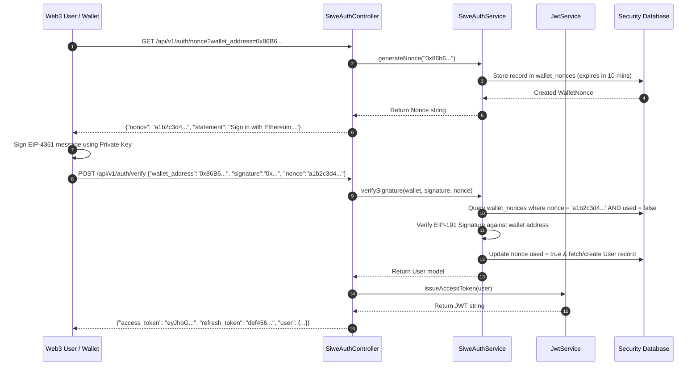

# YieldForge Enterprise Security & API Gateway Documentation (Phase B6)

## Overview

Phase B6 implements an independent security, authentication, role-based authorization (RBAC), and API gateway protection layer without altering underlying smart contracts, B2 Blockchain Adapter, B3 Indexer Engine, B4 Analytics Engine, or B5 Monitoring Platform.

---

## 🔒 Core Security Mechanisms

### 1. JWT Authentication (`JwtService`)
- Issues HMAC-SHA256 access tokens containing `sub` (User ID), `wallet`, `roles`, `permissions`, `iat`, and `exp` (1-hour validity).
- Employs 14-day refresh tokens stored as cryptographic SHA-256 hashes in `refresh_tokens`.

### 2. Sign-In With Ethereum (SIWE / EIP-4361 & EIP-191) (`SiweAuthService`)
- `GET /api/v1/auth/nonce?wallet_address=0x...`: Generates a cryptographically secure 16-byte hex nonce with 10-minute expiry stored in `wallet_nonces`.
- `POST /api/v1/auth/verify`: Verifies EIP-191 message signatures against wallet nonces. Upon verification, the nonce is marked `used = true` to prevent replay attacks, and a JWT access token is issued.

### 3. Role-Based Access Control (RBAC) (`RbacService`)
- Configured Roles: `Admin`, `Operator`, `Analyst`, `ReadOnly`, `ApiClient`.
- Granular Permissions: `monitoring.view`, `analytics.view`, `analytics.export`, `alerts.manage`, `indexer.sync`, `indexer.replay`, `users.manage`, `security.manage`.

### 4. API Key Gateway (`ApiKeyService`)
- Generates API keys formatted as `yf_live_<32 hex chars>` with SHA-256 key hashing (`key_hash`), IP allowlists, scope restrictions, and expiration timestamps.

### 5. API Gateway Middlewares
- **JwtAuthMiddleware**: Validates Bearer access tokens.
- **ApiKeyAuthMiddleware**: Authenticates `X-API-Key` or `Bearer yf_...` headers.
- **RbacMiddleware**: Enforces scope/permission checks (returns `403 Forbidden`).
- **RequestSignatureMiddleware**: Validates HMAC-SHA256 signature (`X-Signature`), timestamp freshness (`X-Timestamp` within 300s), and nonce (`X-Nonce`).
- **ReplayProtectionMiddleware**: Rejects replayed nonces using a sliding-window cache.
- **AdaptiveRateLimiterMiddleware**: Tiered rate limiting (60 req/min for anonymous, 300 req/min for authenticated, 1000 req/min for admin, 600 req/min for API keys).

---

## 🔄 SIWE Wallet Authentication Flow

